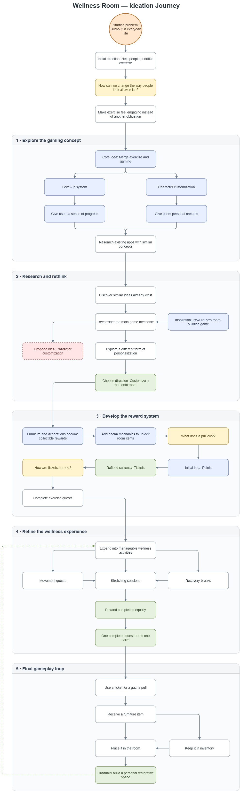
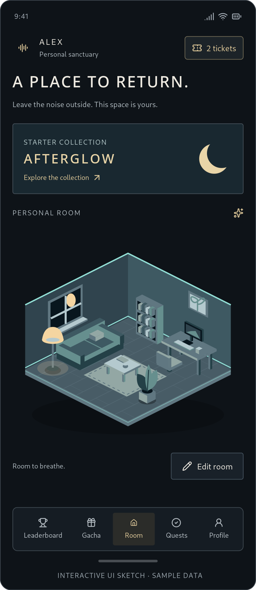
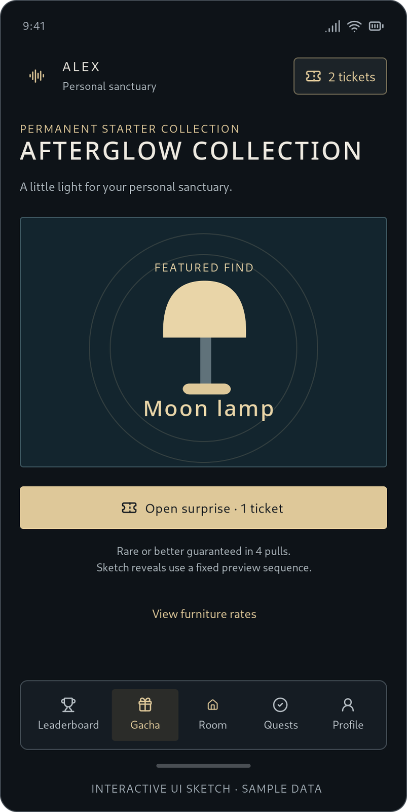
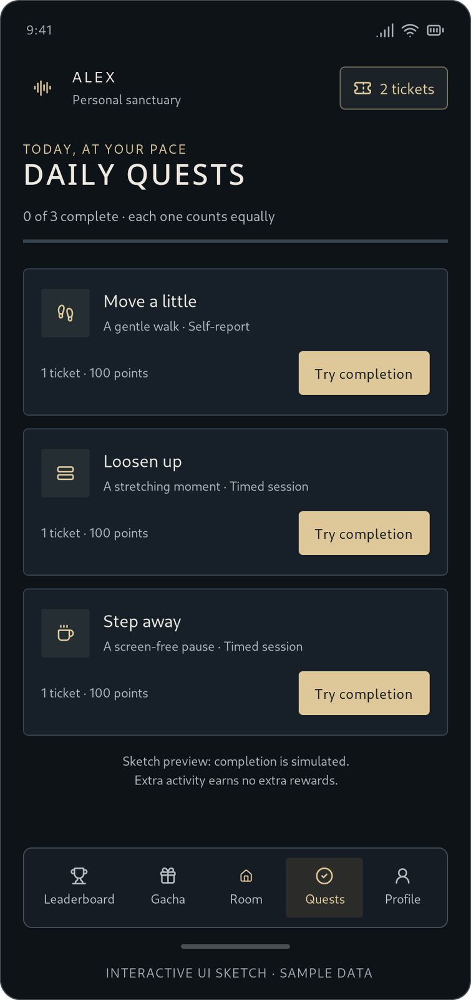
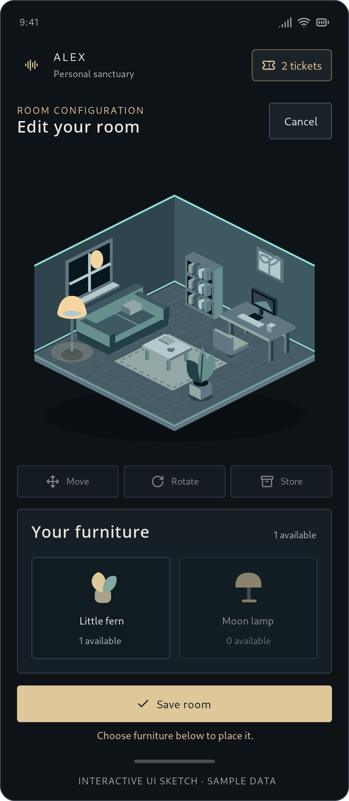

# ReViVe by First Timer

**Team:** Amir Danish bin Bakri, Muhammad Firdaus bin Jaafar, Muhammad Naqib bin Zull Azri 

**Problem Statement:** Stress & Workload Manager

**Video Presentation:** [Unlisted YouTube Link]

**Presentation Slides:** [Public Link]

## 1. Project Overview

### The Problem

Burnout is becoming increasingly common among students and young adults due to academic pressure, long screen time, sedentary routines, and difficulty maintaining healthy habits. Although exercise and regular movement can help support wellbeing, many people struggle to stay consistent because exercise can feel repetitive or like another task to complete.

The main stakeholders are students and young adults who experience stress, fatigue, or difficulty maintaining active routines. Other stakeholders may include educational institutions and wellness communities that want to encourage healthier habits.

Existing apps such as **Habitica** and **Finch** use gamification to encourage positive habits. However, they are not mainly focused on combining physical exercise tracking with camera detection, motion sensors, collectible furniture, and room customisation.

### Our Solution

**Wellness Room** is a gamified exercise application that encourages users to complete exercise quests and turn physical activity into in-game progress. Camera detection and motion sensor integration help track selected exercises and body movement. By completing quests, users earn tickets that can be used for gacha pulls to collect furniture and decorations. These items can then be stored, managed, and used to customise a personal virtual room.

### Core Features

- **Exercise Quests** – Users complete different exercise activities to earn rewards.
- **Camera Detection** – Detects body movement during selected exercises.
- **Motion Sensor Integration** – Uses device sensors to track physical movement during exercise.
- **Ticket Reward System** – Completing exercise quests rewards users with tickets.
- **Gacha System** – Tickets can be used to pull furniture and decorative items.
- **Room Customisation** – Collected furniture can be placed inside a personal virtual room.
- **Inventory System** – Users can store and manage furniture before placing it.

## 2. Ideation & Process

### 2.1 Ideas We Considered

Table of every distinct idea generated, with why each was kept or dropped. Order it so that chosen ideas are listed first.

| Idea | Why it was dropped / kept | 
|---|---| 
| **Exercise Quests (Chosen)** | Kept because users complete exercise quests to earn rewards. | 
| **Camera Detection (Chosen)** | Kept because it can detect body movements during selected exercises. |
| **Motion Sensor Integration (Chosen)** | Kept because it helps track real-world movement during exercise. |
| **Room Customisation (Chosen)** | Kept because it gives users a visual sense of progress and personalisation. | 
| **Gacha System (Chosen)** | Kept because it makes unlocking furniture more exciting. | 
| **Ticket System (Chosen)** | Kept because tickets are used to perform gacha pulls. |  
| **Character Customisation** | Dropped because we decided to focus on room customisation instead. | 
| **To-Do List System** | Dropped because we decided to focus more on exercise and wellness quests. | 
| **Energy Cost for To-Do Tasks** | Dropped because the energy cost system made the to-do list more complicated. | 
| **User Energy Bar** | Dropped together with the to-do list system because it was no longer needed. | 

### 2.2 Ideation Boards

Our idea started from the problem of everyday burnout and the question of how we could make exercise feel less like another obligation. We explored gamification through level-up systems and character customization, but after researching similar applications, we dropped the character customization idea and shifted towards building and decorating a personal wellness room.

We then introduced a gacha reward system where users earn tickets by completing wellness quests such as movement, stretching, and recovery activities. This eventually became our final loop: complete wellness activities, earn tickets, unlock furniture, and gradually build a personal restorative space.

## 3. Design & Prototype

UI Prototype: [https://www.figma.com/proto/BozJPPAd1uH1v4sk9bK72Q/Revive?node-id=18-2&p=f&t=58dcYpsMvi1uJXcu-1&scaling=min-zoom&content-scaling=fixed&page-id=0%3A1&starting-point-node-id=18%3A2]

Our prototype demonstrates the main user flow, from completing exercise quests to earning rewards and customising a personal room.

### Key Screens

#### Room Screen

The main room screen shows the user's personal space and provides access to room customisation.

#### Gacha Screen

Users spend tickets to perform gacha pulls and unlock furniture items.

#### Quests Screen

Users can view and complete exercise quests to earn tickets and other rewards.

#### Edit Room Screen

Users can select, move, rotate, store, and place collected furniture to customise their room.

## 4. What Makes It Different

### Gamified Exercise Rewards
Users earn tickets by completing exercise quests and use them for gacha pulls instead of only tracking exercise progress.

### Camera Detection
The camera can be used to detect the user's body movement during selected exercises, helping the system verify that the activity is being performed.

### Motion Sensor Integration
Motion sensors can track movement and activity during exercise, allowing the app to connect real-world physical movement with in-game progress.

### Gacha Furniture Collection
Users can unlock furniture of different rarities through the gacha system, making rewards more exciting and unpredictable.

### Room Customisation
The furniture collected from gacha pulls can be placed inside the user's own virtual room, making progress more visual and personal.

### Furniture Rarity Points
Each furniture item gives a different number of points based on its rarity, giving rare items more value.

### Leaderboard
Users are ranked based on the total points from their furniture collection, adding a competitive element to the app.

### Our Twist
Our main twist is combining **exercise quests, camera detection, motion sensor tracking, gacha rewards, furniture collection, room customisation, and leaderboard competition** in one system. Real-world physical activity directly contributes to the user's virtual progress and room collection.

## 5. Technical Architecture & Feasibility

### Tech Stack

| Technology | Purpose | Why we chose it / Constraints |
|---|---|---|
| **React Native + Expo** | Mobile frontend | Allows us to build one mobile application quickly for both Android and iOS. |
| **Expo Camera** | Camera-based exercise detection | Provides access to the device camera for selected exercise detection. Accuracy may depend on lighting and device performance. |
| **Expo Sensors** | Motion sensor integration | Allows us to access device motion sensors such as the accelerometer and gyroscope. |
| **Supabase** | Backend and database | Stores user data, tickets, quests, furniture and inventory. It is quick to set up and suitable for a prototype. |
| **Supabase Auth** | User authentication | Provides a simple way to manage user accounts and login. |
| **Figma** | UI/UX design | Used to design and prototype the application before development. |
| **Expo / EAS** | Testing and deployment | Makes it easier to test the application on physical mobile devices. |

### Build Plan & Scope

During the building phase, we plan to focus on the main gameplay loop:

1. **Exercise Quests** – Build a small set of exercise activities for users to complete.
2. **Exercise Detection** – Use camera detection and motion sensors for selected exercises.
3. **Ticket Rewards** – Award tickets after users complete quests.
4. **Gacha System** – Allow users to spend tickets to receive random furniture items.
5. **Inventory** – Store and display collected furniture.
6. **Room Customisation** – Allow users to place and manage furniture inside their room.
7. **Backend Storage** – Save user progress, tickets and collected furniture.

For the hackathon prototype, we will focus on making the full **exercise → reward → gacha → furniture → room customisation** flow functional first.

More advanced features can be expanded later after the core system is working.
